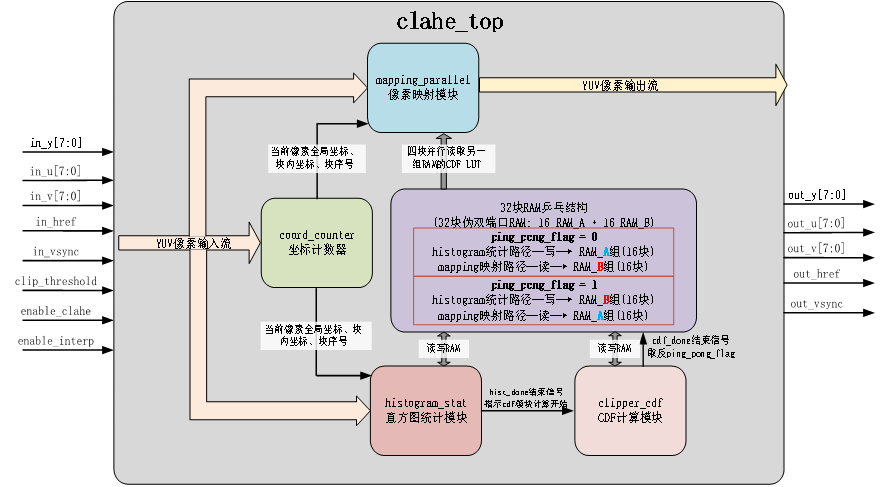
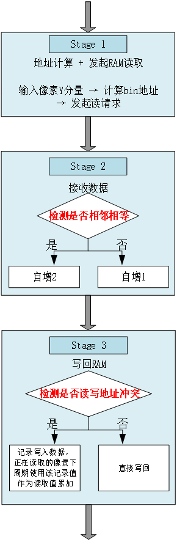
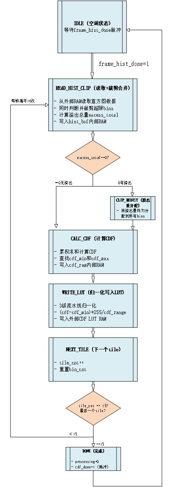
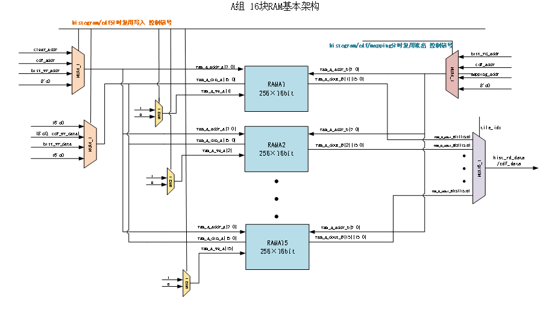
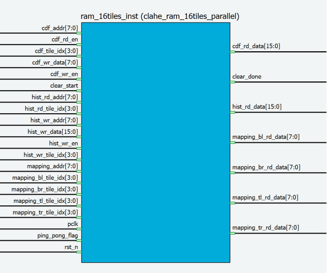
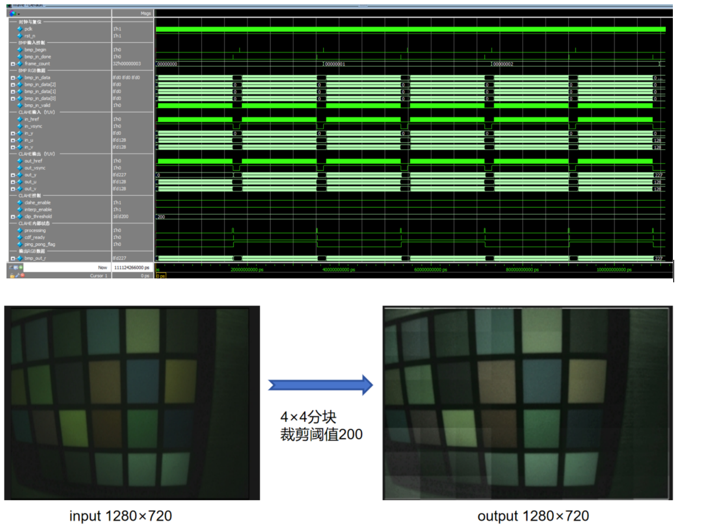

# CLAHE FPGA Project

一个完整的**对比度受限自适应直方图均衡化（CLAHE）**算法的 FPGA 硬件实现项目，提供 16 tile 与 64 tile 两个可复现的参考设计，包含完整的 RTL 代码、测试平台、仿真脚本与详细文档。

## 📖 项目简介

CLAHE（Contrast Limited Adaptive Histogram Equalization）是一种经典的图像增强算法，通过将图像分割成多个子区域（tiles），对每个子区域独立进行直方图均衡化处理，并使用插值技术消除边界块效应，从而实现局部对比度增强。本项目实现了该算法的 FPGA 硬件加速版本，支持实时视频处理。

### 核心特性

- ✅ **实时视频处理**：支持 1280×720@30fps 实时处理
- ✅ **双 tile 规模**：提供 16 tile（4×4）和 64 tile（8×8）两个版本
- ✅ **流水线架构**：5 级流水线设计，实现 1 像素/周期的处理吞吐率
- ✅ **双线性插值**：消除 tile 边界块效应，提供平滑的图像增强效果
- ✅ **Ping-Pong 架构**：帧间乒乓操作，实现统计与映射并行处理
- ✅ **YUV 格式支持**：支持 YUV 三路数据输入输出，确保数据同步
- ✅ **完整仿真环境**：支持 ModelSim/Questa、VCS、Icarus Verilog 等多种仿真器

## 🎯 算法原理

CLAHE 算法的处理流程包括以下几个步骤：

1. **图像分块**：将输入图像分割成多个不重叠的子区域（tiles）
2. **直方图统计**：对每个 tile 内的像素进行直方图统计
3. **对比度裁剪**：对直方图进行裁剪，限制对比度增强的幅度
4. **CDF 计算**：计算裁剪后直方图的累积分布函数（CDF）
5. **像素映射**：使用 CDF 将像素值映射到新的亮度值
6. **双线性插值**：对相邻 tiles 的映射结果进行插值，消除边界效应

#### clahe_top — 顶层模块

源代码：[projects/16tile/rtl/clahe_top.v](projects/16tile/rtl/clahe_top.v) | [projects/64tile/rtl/clahe_top.v](projects/64tile/rtl/clahe_top.v)



顶层模块负责整个CLAHE系统的集成和协调，管理各子模块间的数据流和控制流，实现乒乓控制逻辑。
在CDF计算完成时切换ping_pong_flag，充分利用帧间隙时间，确保下一帧vsync上升沿来临前，乒乓切换已完成。

```verilog
// 优化的乒乓切换逻辑 (在CDF完成时切换)
always @(posedge pclk or negedge rst_n) begin
    if (!rst_n)
        ping_pong_flag <= 1'b0;
    else if (cdf_done_posedge)
        ping_pong_flag <= !ping_pong_flag;
end
```

#### clahe_coord_counter — 坐标计数器模块

源代码：[projects/16tile/rtl/clahe_coord_counter.v](projects/16tile/rtl/clahe_coord_counter.v) | [projects/64tile/rtl/clahe_coord_counter.v](projects/64tile/rtl/clahe_coord_counter.v)

实时计算输入像素的全局坐标、所属tile索引和tile内相对坐标，为直方图统计和像素映射提供位置信息。

在href有效期间递增横向坐标x_cnt，行结束时递增纵向坐标y_cnt，帧无效期间复位所有计数器。对于块tile的索引计算，使用比较器链代替除法器（节省资源）。

横向索引：tile_x = f(x_cnt / 320)；纵向索引：tile_y = f(y_cnt / 180)；

总索引：tile_idx = {tile_y, tile_x}（4bit）。

其中块内坐标的计算，使用移位加法计算，减少资源使用。

local_x = x_cnt - tile_x * 320，local_y = y_cnt - tile_y * 180，

乘法用移位替代：

tile_x * 320 = (tile_x << 8) + (tile_x << 6)，

tile_y * 180 = (tile_y << 7) + (tile_y << 5) + (tile_y << 4) + (tile_y << 2)。

```verilog
// 横向tile索引计算 (避免除法器)
always @(*) begin
    if (x_cnt < 320)
        tile_x = 2'd0;
    else if (x_cnt < 640)
        tile_x = 2'd1;
    else if (x_cnt < 960)
        tile_x = 2'd2;
    else
        tile_x = 2'd3;
end
```

#### clahe_histogram_stat — 直方图统计模块

源代码：[projects/16tile/rtl/clahe_histogram_stat.v](projects/16tile/rtl/clahe_histogram_stat.v) | [projects/16tile/rtl/clahe_histogram_stat_v2.v](projects/16tile/rtl/clahe_histogram_stat_v2.v) | [projects/64tile/rtl/clahe_histogram_stat.v](projects/64tile/rtl/clahe_histogram_stat.v)



对每个tile的256个灰度级进行实时统计，使用3级流水线实现读-增-写操作。

对于这种流水读写ram情况，极易出现读写冲突情况（读写同一地址），经分析存在以下冲突情况：

1：连续相同像素值

例如像素序列：100, 100, 50，对于第二个100像素，读取统计旧值时，第一个100的累加值暂未写入，导致第二个像素累加值会发生错误。

2：间隔相同像素值（流水线深度冲突）

例如像素序列：100, 50, 100...（间隔2周期，< 流水线深度3）

第二个100像素值读入所在周期，其读地址产生，同时第一个100在该周期写入累加值，故发生读写冲突。

对于问题1，检测连续输入的相同像素值，合并为一次RAM写入，确保统计值正确的同时大幅减少RAM访问次数。

```verilog
// 比较当前输入与上一周期输入
if ((in_href && in_vsync && clear_done) && valid_s1 &&
    (in_y == pixel_s1) &&
    (tile_idx == tile_s1)) begin
    same_as_prev <= 1'b1; // 检测到相邻相同
end
else begin
    same_as_prev <= 1'b0;
end
```

如果出现相邻相等的情况，那么此时统计值自增二，来补偿读到的旧值带来的误差

```verilog
// 相邻相同时增量为2，否则为1
if (same_as_prev) begin
    increment_s2 <= 2'd2;
end
else begin
    increment_s2 <= 2'd1;
end
```

对于问题2，其实可以使用真双端口RAM并配置为写优先模式来解决读写冲突问题，但是为了减少资源占用，部署更多算法，这里仍采用伪双端口ram，通过旁路逻辑解决读写冲突。若当前周期发生写地址与读地址相同，那么寄存当前写数据，作为本周期正在读的像素的读取值，不再使用从ram读取到的未更新的旧数据。下附关键代码，具体流程可参考流程图。

```verilog
// 1. 冲突检测: Stage1读地址 == Stage3写地址
wire conflict = (pixel_s1 == pixel_s3) &&
                (tile_s1 == tile_s3) &&
                valid_s3;

// 2. 旁路数据保存 (在冲突时锁存Stage3的写数据)
always @(posedge pclk or negedge rst_n) begin
    if (!rst_n) begin
        bypass_valid <= 1'b0;
        bypass_data <= 16'd0;
    end
    else begin
        if (conflict) begin
            bypass_valid <= 1'b1;         // 有冲突: 置1
            bypass_data <= ram_wr_data_s3; // // 保存Stage3写入值
        end
        else begin
            bypass_valid <= 1'b0;         // 无冲突: 清零（不过写是不写入才对）
        end
    end
end

// 3. 数据选择: 旁路优先 (Stage 2使用)
wire [15:0] selected_data = bypass_valid ? bypass_data : ram_rd_data_b;
                            // 旁路有效?    使用旁路值      使用RAM读值

// 4. 如果 bypass_valid = 1, 使用保存的写入数据自增;
always @(posedge pclk or negedge rst_n) begin
    // ... 复位逻辑 ...
    // ...
    else begin
        // ...
        // 关键计算: 写入值 = 选择的数据 + 增量
        ram_wr_data_s3 <= selected_data + increment_s2;
    end
end
```

#### clahe_clipper_cdf — 对比度限制与 CDF 计算模块

源代码：[projects/16tile/rtl/clahe_clipper_cdf.v](projects/16tile/rtl/clahe_clipper_cdf.v) | [projects/64tile/rtl/clahe_clipper_cdf.v](projects/64tile/rtl/clahe_clipper_cdf.v)

该模块在histogram结束后，对每帧图像16个tile的直方图数据进行Clip阈值限制裁剪和CDF计算，最后归一化生成像素映射查找表。使用的有限状态机流程如下。



表1 clahe_clipper_cdf模块不同状态消耗周期统计表

|     |     |     |
| --- | --- | --- |
| 状态  | 周期数 | 说明  |
| READ_HIST_CLIP | 257 | 读取+裁剪 |
| CLIP_REDIST | 257 | 仅在有溢出时执行 |
| CALC_CDF | 257 | 累积分布函数计算 |
| WRITE_LUT | 259 | 3级流水线归一化写入 |
| NEXT_TILE | 1   | tile切换 |
| DONE | 1   | 产生cdf_done脉冲 |

分析该流程在每帧中的耗时，由上表可知，每块tile总周期数约257+257+257+259+1+1=1032周期，16块耗时约16*1032=16512周期，在96MHz时钟频率下耗时约172μs， 1280×720@30fps帧间隙约33ms，所以cdf模块的处理时间充足。同时，cdf模块在histogram统计结束后立即开始，充分利用帧间隙时间，提升性能。

#### clahe_ram_16tiles_parallel — RAM管理模块

源代码：[projects/16tile/rtl/clahe_ram_16tiles_parallel.v](projects/16tile/rtl/clahe_ram_16tiles_parallel.v) | [projects/64tile/rtl/clahe_ram_64tiles_parallel.v](projects/64tile/rtl/clahe_ram_64tiles_parallel.v)



clahe_ram_16tiles_parallel模块负责管理32块伪双端口RAM，实现乒乓操作、四块并行读取和多端口仲裁。上图仅展示A组16块的主要架构，B组架构相同，通过乒乓操作进行切换。

cdf计算模块和histogram模块同一时刻只需一组读写端口，所以为了尽可能减少资源利用，使用伪双端口ram。同时由于mapping模块进行双线性插值时需要并行读取四个块（tile）的计算结果，所以每一分块都需要分配一块ram，共需16块ram。为了避免统计写入和映射模块读出冲突，我们设计使用乒乓双组RAM架构，架构如下：

帧N（ping_pong_flag=0）：

- RAM_A组：用于统计（Port A写，Port B读）

- RAM_B组：用于映射（Port B四块并行只读）

帧N+1（ping_pong_flag=1）：

- RAM_B组：用于统计（Port A写，Port B读）

- RAM_A组：用于映射（Port B四块并行只读）

模块接口如下图所示，cdf模块与histogram模块同一时刻只需读取单一地址数据，故与cdf计算模块、hist直方图统计模块的连接分别引出一组读写端口，内部进行仲裁复用。由于mapping模块中的双线性插值需要读取当前像素最近的四个块（tile）的输出LUT，为了实现mapping模块的全流水，实现了四个块的并行读取，引出mapping模块需要使用的四个读数据端口和读地址端口，由mapping模块计算得到四个块的坐标输入，进行地址译码，同时输出四个块的读取数据。



##### 仿真及上板综合

鉴于图像区域每个分块都需要分配一块BRAM，为减少资源占用，故本工程采用4×4=16分块设计，虽然实际输出效果远不如8×8tile，但效果优于传统的HE算法。

modelsim仿真波形及图片结果如下：



受限于硬件实现的除法精度问题，输出图像不可避免地保留有较明显的分块效应，但该块边界可通过在YUV域进行双边滤波减轻。

详细算法说明请参考 `docs/RTL_OVERVIEW.md`。

## 🏗️ 项目结构

```
CLAHE/
├── README*.md                    # 多语言入口文档
├── docs/                         # 项目文档
│   ├── README.md                 # 统一文档说明
│   └── RTL_OVERVIEW.md           # RTL 模块详细解析
├── projects/                     # 各版本实现
│   ├── 16tile/                   # 16 tile 版本（4×4 tiles）
│   │   ├── rtl/                  # RTL 源代码
│   │   ├── tb/                   # 测试平台
│   │   ├── sim/                  # 仿真脚本
│   │   ├── scripts/              # 辅助脚本
│   │   └── assets/               # 测试资源
│   └── 64tile/                   # 64 tile 版本（8×8 tiles，主线）
│       ├── rtl/                  # RTL 源代码
│       ├── tb/                   # 测试平台
│       ├── sim/                  # 仿真脚本
│       ├── scripts/              # 辅助脚本
│       └── assets/               # 测试资源
└── flows/                        # 统一仿真流程
    └── full_sim/                 # 跨 EDA 整帧 BMP 仿真
        ├── CLAHE/                # RTL 代码
        ├── bmp_in/               # 输入测试图像
        ├── bmp_test_results/     # 仿真输出结果
        └── sim_clahe_*.do/sh     # 仿真脚本
```

## 🔧 硬件架构

### 主要模块

| 模块 | 功能描述 | 16tile 文件 | 64tile 文件 |
|------|---------|------------|------------|
| `clahe_coord_counter.v` | 像素坐标计数与 tile 定位 | [16tile](projects/16tile/rtl/clahe_coord_counter.v) | [64tile](projects/64tile/rtl/clahe_coord_counter.v) |
| `clahe_histogram_stat*.v` | 3 级流水线直方图统计 | [16tile v2](projects/16tile/rtl/clahe_histogram_stat_v2.v) / [16tile](projects/16tile/rtl/clahe_histogram_stat.v) | [64tile](projects/64tile/rtl/clahe_histogram_stat.v) |
| `clahe_clipper_cdf.v` | 对比度裁剪与 CDF 生成 | [16tile](projects/16tile/rtl/clahe_clipper_cdf.v) | [64tile](projects/64tile/rtl/clahe_clipper_cdf.v) |
| `clahe_mapping_parallel.v` | 并行像素映射与双线性插值 | [16tile](projects/16tile/rtl/clahe_mapping_parallel.v) | [64tile](projects/64tile/rtl/clahe_mapping_parallel.v) |
| `clahe_ram_*tiles_parallel.v` | 伪双端口 RAM 框架 | [16tile](projects/16tile/rtl/clahe_ram_16tiles_parallel.v) | [64tile](projects/64tile/rtl/clahe_ram_64tiles_parallel.v) |
| `clahe_top.v` | 顶层模块，集成所有功能 | [16tile](projects/16tile/rtl/clahe_top.v) | [64tile](projects/64tile/rtl/clahe_top.v) |

### 流水线设计

- **Stage 1**: 坐标计数与 tile 索引计算
- **Stage 2**: 直方图统计（3 级子流水线）
- **Stage 3**: 对比度裁剪与 CDF 计算（帧间处理）
- **Stage 4**: CDF 查找与双线性插值（5 级子流水线）
- **Stage 5**: 数据对齐与输出

详细架构说明请参考 `docs/RTL_OVERVIEW.md`。

## 📊 性能指标

### 16 tile 版本（4×4 tiles）

- **Tile 配置**: 4×4 = 16 tiles
- **Tile 尺寸**: 320×180 像素
- **处理能力**: 1280×720@30fps
- **吞吐率**: 1 像素/周期
- **流水线级数**: 5 级
- **清零时间**: 256 周期（@100MHz 约 2.56μs）

### 64 tile 版本（8×8 tiles）

- **Tile 配置**: 8×8 = 64 tiles
- **Tile 尺寸**: 160×90 像素
- **处理能力**: 1280×720@30fps
- **吞吐率**: 1 像素/周期
- **流水线级数**: 5 级
- **清零时间**: 256 周期（@100MHz 约 2.56μs）
- **性能提升**: 相比 16 tile 版本，64 tile 版本在局部对比度增强方面表现更好

## 🚀 快速开始

### 环境要求

- **仿真工具**（任选其一）:
  - Mentor Graphics ModelSim/QuestaSim
  - Synopsys VCS
  - Icarus Verilog
- **Python 3**: 用于验证脚本和图像处理
- **操作系统**: Windows/Linux（本项目在 Windows 下开发测试）

### 快速运行

1. **克隆仓库**

   ```bash
   git clone <repository-url>
   cd CLAHE
   ```

2. **选择版本**
   - 入门学习：使用 `projects/16tile/`
   - 生产应用：使用 `projects/64tile/`

3. **运行仿真**（以 64tile 版本为例）

   ```bash
   cd projects/64tile/sim
   vsim -do run_all.do
   ```

   或使用整帧 BMP 测试：

   ```bash
   cd flows/full_sim
   vsim -do sim_clahe_bmp.do
   ```

4. **查看结果**
   - 输出图像：`bmp_test_results/output/`
   - 波形文件：根据仿真脚本生成的 `.wlf` 或 `.vcd` 文件

### 使用其他仿真器

- **VCS**:

  ```bash
  cd flows/full_sim
  ./sim_clahe_vcs.sh
  ```

- **Icarus Verilog**:

  ```bash
  cd flows/full_sim
  ./sim_clahe_iverilog.sh
  ```

## 📚 文档导航

### 主要文档

- **[README_ZH.md](README_ZH.md)**: 中文详细说明
- **[README_EN.md](README_EN.md)**: English detailed guide
- **[docs/README.md](docs/README.md)**: 统一的 16tile/64tile/整帧仿真说明
- **[docs/RTL_OVERVIEW.md](docs/RTL_OVERVIEW.md)**: RTL 模块算法原理与实现详解

### 模块文档

- `clahe_coord_counter.v`: 坐标计数与 tile 定位
- `clahe_histogram_stat*.v`: 直方图统计与冲突处理
- `clahe_clipper_cdf.v`: 对比度裁剪与 CDF 生成
- `clahe_mapping_parallel.v`: 并行映射与双线性插值
- `clahe_ram_*tiles_parallel.v`: RAM 架构与 Ping-Pong 设计

## 🧪 测试与验证

### 测试平台

- **模块级测试**: `projects/*/tb/tb_clahe_*.v` - 各模块独立测试
- **顶层测试**: `projects/*/tb/tb_clahe_top_bmp.v` - 整帧 BMP 输入测试
- **冲突测试**: `projects/*/tb/tb_histogram_conflict_test.v` - 直方图统计冲突场景

### 验证脚本

- `verify_output.py`: 输出图像与黄金模型对比
- `verify_cdf_golden.py`: CDF 计算结果校验
- `compare_results.py`: 批量结果对比

### 测试资源

- 输入图像：`assets/images/` 或 `flows/full_sim/bmp_in/`
- 输出结果：`bmp_test_results/output/`
- 参考数据：`assets/data/`

## 🎛️ 配置参数

### 图像参数

```verilog
parameter IMG_WIDTH = 1280,     // 图像宽度
parameter IMG_HEIGHT = 720,     // 图像高度
```

### Tile 配置

**16 tile 版本**:

```verilog
parameter TILE_H_NUM = 4,       // 水平 tile 数量
parameter TILE_V_NUM = 4,       // 垂直 tile 数量
parameter TILE_NUM = 16,        // 总 tile 数
```

**64 tile 版本**:

```verilog
parameter TILE_H_NUM = 8,       // 水平 tile 数量
parameter TILE_V_NUM = 8,       // 垂直 tile 数量
parameter TILE_NUM = 64,        // 总 tile 数
```

### 处理模式

- **插值模式** (`enable_clahe=1, enable_interp=1`): 使用双线性插值，效果最佳
- **单 tile 模式** (`enable_clahe=1, enable_interp=0`): 单 tile 映射，处理速度快
- **Bypass 模式** (`enable_clahe=0`): 直接输出原始数据

## 🔍 关键技术亮点

1. **Ping-Pong 架构**: 使用双缓冲实现统计与映射的并行处理，提高吞吐率
2. **冲突处理机制**: 针对相邻重复（AA）和间隔重复（ABA）场景的优化处理
3. **并行 RAM 读取**: 单周期读取四个相邻 tile 的 CDF 数据，减少流水线级数
4. **双线性插值**: 8bit 输入扩展到 16bit 计算，确保平滑过渡
5. **参数化设计**: 通过参数化支持不同 tile 规模和图像分辨率

## 📝 开发与维护

### 版本说明

- **16tile 版本**: 早期实现，适合教学和算法验证，资源占用较小
- **64tile 版本**: 主线版本，功能完整，适合实际应用

### 代码规范

- RTL 代码遵循 Verilog-2001 标准
- 模块命名采用 `clahe_` 前缀
- 参数化设计，便于配置和扩展

### 贡献指南

1. 新功能开发建议在 `projects/64tile/` 版本上进行
2. 修改 RTL 后请更新 `docs/RTL_OVERVIEW.md`
3. 提交前运行完整仿真验证：`sim/run_all.do` + `flows/full_sim`

## 📄 许可证

本项目为开源项目，具体许可证信息请查看 LICENSE 文件。

---

## Language / 语言

- 🇨🇳 [中文详细说明](README_ZH.md)
- 🇬🇧 [English Detailed Guide](README_EN.md)

> 更多技术细节请参考 `docs/` 目录下的详细文档。
