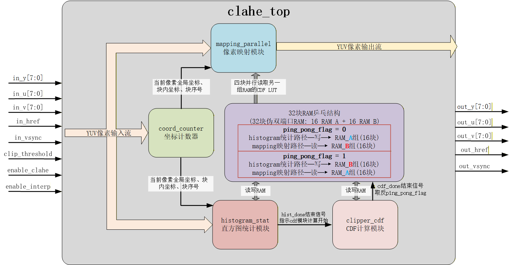
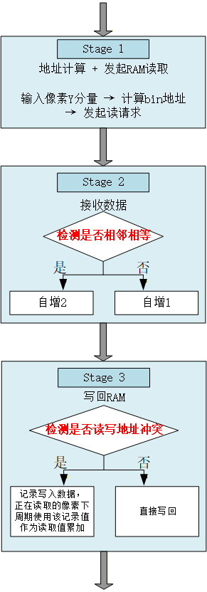
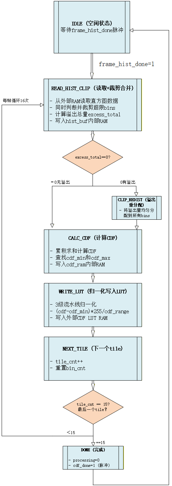
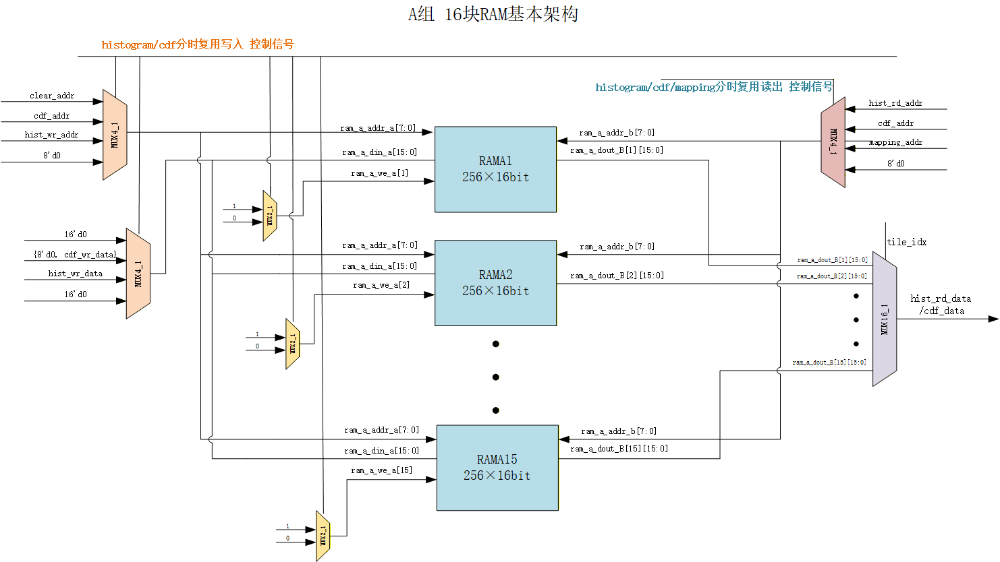
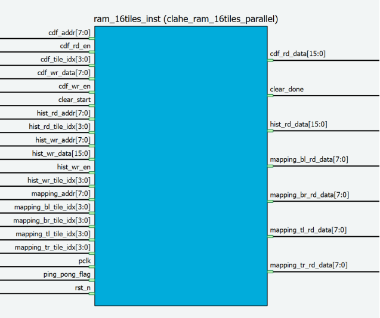
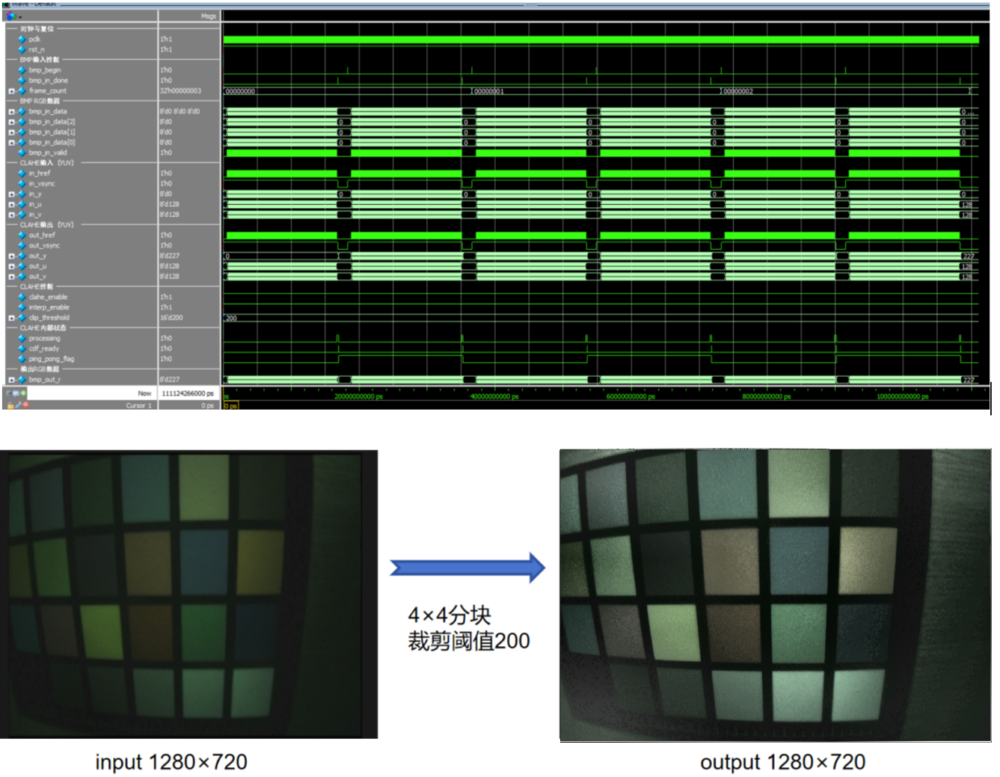
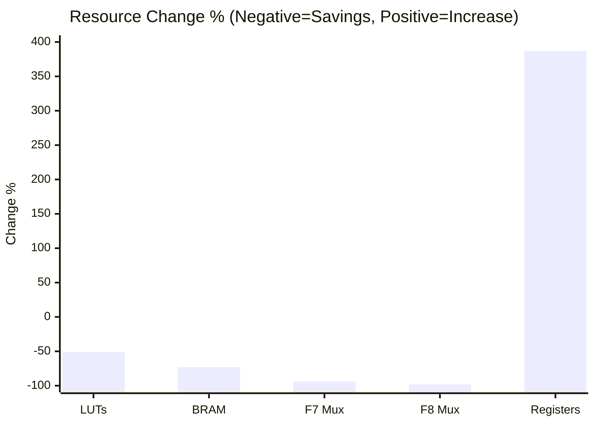

# CLAHE FPGA Project

Welcome! Please pick a language:

[](README.md)
[](README_EN.md)

---

## 📖 Project Introduction

CLAHE (Contrast Limited Adaptive Histogram Equalization) is a classic image enhancement algorithm. By dividing an image into multiple sub-regions (tiles), performing histogram equalization independently on each tile, and using interpolation techniques to eliminate boundary blocking artifacts, it achieves local contrast enhancement. This project implements an FPGA hardware acceleration version of this algorithm, supporting real-time video processing.

> [!IMPORTANT]
> 🚀 **Current optimized implementation achieves 720P @ 176.4MHz clock frequency**

### Core Features

- ✅ **Real-time Video Processing**: Supports 1280×720@60fps real-time processing.
- ✅ **Dual Tile Scales**: Provides two versions: 16 tiles (4×4) and 64 tiles (8×8).
- ✅ **Pipeline Architecture**: 5-stage pipeline design, achieving a throughput of 1 pixel/cycle.
- ✅ **Bilinear Interpolation**: Eliminates tile boundary artifacts, providing smooth image enhancement.
- ✅ **Ping-Pong Architecture**: Inter-frame ping-pong operation enabling parallel processing of statistics and mapping.
- ✅ **YUV Format Support**: Supports YUV three-channel data input/output, ensuring data synchronization.
- ✅ **Complete Simulation Environment**: Supports multiple simulators like ModelSim/Questa, VCS, Icarus Verilog, etc.

## 📅 Optimization Roadmap
### Parallel Banked Memory Optimization (Completed ✅)

We have implemented a highly optimized **8x8 (64 tiles)** version.
**Core Strategy**: Adopts **VLSI DSP Hardware Folding & Memory Interleaving** techniques to map 64 logical tiles into 4 physical RAM banks.
- **Key Highlights**:
    - **4-Bank Interleaved**: Using  mapping strategy, achieving conflict-free parallel access for any 2x2 neighborhood.
    - **Port Folding**: Using time-division multiplexing to fold 64 logical read/write ports onto 4 physical RAMs (2 ports each).
    - **Resource Reduction**: Reduces RAM instances from **64 to 4**, saving **93.75%** of BRAM resources compared to the original 64-tile version.
    - **Timing Convergence**: Maintains **1 pixel/cycle** throughput with a streamlined logic hierarchy.

> [!NOTE]
> The repository provides 8x8 and 4x4 versions for reference.
> 🔒 **Optimized version and other parameter configurations**. To request access, please contact the author: 📧 **1852282973@qq.com**. Discussions and exchanges are welcome!

### Future Work: High-Frequency Timing Optimization
While the current design meets 720p@60fps (74.25MHz) and even 1080p@60fps (148.5MHz) requirements, there is room for optimization in high-performance scenarios (e.g., 4K processing).
- [ ] **Retiming / Register Balancing**: Insert finer-grained pipeline registers within the Crossbar Mux tree to break long combinational logic chains.
- [ ] **Critical Path Analysis**: Restructure logic targeting critical paths identified in synthesis reports (typically in Bank selection logic).


## 🏗️ Project Structure


The repository is organized by function and usage: Source Code (RTL), Testbenches, Simulation Flows, Documentation, and Synthesis/Implementation artifacts.

```
CLAHE/
├── fpga报告.md                 # Project Report (Chinese, optional)
├── LICENSE                     # License
├── README*.md                  # Multi-language entry docs (Chinese/English)
├── artifacts/                  # Outputs from synthesis/implementation (e.g., QDB, QPG, reports)
├── work/                       # Working directory for simulators (ModelSim/Questa) (can be ignored/cleaned)
├── vivado_project/             # Xilinx Vivado project files (for synthesis/simulation reference)
├── docs/                       # Detailed design docs and RTL module flow descriptions
├── pictures/                   # Image resources used in docs and README
├── projects/                   # Implementation directories for each version (16tile / 64tile)
│   ├── 16tile/                 # 16-tile (4×4) reference implementation (Educational/Lightweight)
│   │   ├── rtl/                # RTL source code and sub-modules
│   │   ├── tb/                 # Testbenches (Module/Top-level)
│   │   ├── sim/                # Simulation scripts (ModelSim/VCS/Icarus, etc.)
│   │   ├── scripts/            # Helper scripts (Image processing, simulation drivers, etc.)
│   │   └── assets/             # Simulation/Test resources (Images, Reference Data)
│   └── 64tile/                 # 64-tile (8×8) Mainline implementation (Higher quality local enhancement)
│       ├── rtl/
│       ├── tb/
│       ├── sim/
│       ├── scripts/
│       └── assets/
├── optimized/                  # 🔒 Optimized Version (Private submodule, contact author for access)
├── flows/                      # Cross-tool/Cross-version simulation and processing flows
│   └── full_sim/               # Full-frame BMP end-to-end simulation flow (includes input/output files & scripts)
└── projects/*/README/          # Quick guides for each version (see subdirectories)
```

## 🎯 Algorithm Principle

The CLAHE algorithm processing flow includes the following steps:

1.  **Image Tiling**: Divide the input image into multiple non-overlapping sub-regions (tiles).
2.  **Histogram Statistics**: Perform histogram statistics for pixels within each tile.
3.  **Contrast Clipping**: Clip the histogram to limit the magnitude of contrast enhancement.
4.  **CDF Calculation**: Calculate the Cumulative Distribution Function (CDF) of the clipped histogram.
5.  **Pixel Mapping**: Map pixel values to new luminance values using the CDF.
6.  **Bilinear Interpolation**: Interpolate the mapping results of adjacent tiles to eliminate boundary effects.

#### clahe_top — Top Level Module

Source Code: [projects/16tile/rtl/clahe_top.v](projects/16tile/rtl/clahe_top.v) | [projects/64tile/rtl/clahe_top.v](projects/64tile/rtl/clahe_top.v)



The top-level module is responsible for the integration and coordination of the entire CLAHE system, managing data flow and control flow between sub-modules, and implementing ping-pong control logic.
The `ping_pong_flag` switches when the CDF calculation is complete, fully utilizing the frame gap time to ensure the ping-pong switch is done before the next frame's vsync rising edge arrives.

```verilog
// Optimized Ping-Pong Switching Logic (Switches when CDF is done)
always @(posedge pclk or negedge rst_n) begin
    if (!rst_n)
        ping_pong_flag <= 1'b0;
    else if (cdf_done_posedge)
        ping_pong_flag <= !ping_pong_flag;
end
```

#### clahe_coord_counter — Coordinate Counter Module

Source Code: [projects/16tile/rtl/clahe_coord_counter.v](projects/16tile/rtl/clahe_coord_counter.v) | [projects/64tile/rtl/clahe_coord_counter.v](projects/64tile/rtl/clahe_coord_counter.v)

Real-time calculation of the global coordinates of input pixels, the tile index they belong to, and the relative coordinates within the tile, providing position information for histogram statistics and pixel mapping.

Increments the horizontal coordinate `x_cnt` during `href` valid period, increments the vertical coordinate `y_cnt` at the end of a line, and resets all counters during frame invalid periods. For tile index calculation, a comparator chain is used instead of a divider (to save resources).

Horizontal Index: `tile_x = f(x_cnt / 320)`
Vertical Index: `tile_y = f(y_cnt / 180)`
Total Index: `tile_idx = {tile_y, tile_x}` (4bit)

For intra-tile coordinate calculation, shift-add operations are used to reduce resource usage.
`local_x = x_cnt - tile_x * 320`
`local_y = y_cnt - tile_y * 180`

Multiplication replaced by shifts:
`tile_x * 320 = (tile_x << 8) + (tile_x << 6)`
`tile_y * 180 = (tile_y << 7) + (tile_y << 5) + (tile_y << 4) + (tile_y << 2)`

```verilog
// Horizontal tile index calculation (Avoiding dividers)
always @(*) begin
    if (x_cnt < 320)
        tile_x = 2'd0;
    else if (x_cnt < 640)
        tile_x = 2'd1;
    else if (x_cnt < 960)
        tile_x = 2'd2;
    else
        tile_x = 2'd3;
end
```

#### clahe_histogram_stat — Histogram Statistics Module

Source Code: [projects/16tile/rtl/clahe_histogram_stat.v](projects/16tile/rtl/clahe_histogram_stat.v) | [projects/16tile/rtl/clahe_histogram_stat_v2.v](projects/16tile/rtl/clahe_histogram_stat_v2.v) | [projects/64tile/rtl/clahe_histogram_stat.v](projects/64tile/rtl/clahe_histogram_stat.v)



Performs real-time statistics for 256 gray levels of each tile, using a 3-stage pipeline to implement Read-Increment-Write operations.

For this pipelined RAM read/write scenario, read-write conflicts (reading and writing the same address) are very likely. Analysis shows the following conflict situations:

1.  **Consecutive Identical Pixels**:
    e.g., Pixel sequence: 100, 100, 50. For the second 100 pixel, when reading the statistical old value, the accumulated value of the first 100 has not yet been written, causing the second pixel's accumulated value to be incorrect.

2.  **Interval Identical Pixels (Pipeline Depth Conflict)**:
    e.g., Pixel sequence: 100, 50, 100... (Interval 2 cycles, < Pipeline Depth 3).
    When the second 100 pixel is read, its read address is generated, while simultaneously the first 100 is writing its accumulated value in that cycle, causing a read-write conflict.

For Problem 1, detect consecutive identical input pixels and merge them into a single RAM write, ensuring correct statistics while significantly reducing RAM access frequency.

```verilog
// Compare current input with previous cycle input
if ((in_href && in_vsync && clear_done) && valid_s1 &&
    (in_y == pixel_s1) &&
    (tile_idx == tile_s1)) begin
    same_as_prev <= 1'b1; // Detected adjacent identical
end
else begin
    same_as_prev <= 1'b0;
end
```

If an adjacent equality occurs, the statistical value is incremented by two to compensate for the error caused by reading the old value.

```verilog
// Increment by 2 if adjacent is same, otherwise by 1
if (same_as_prev) begin
    increment_s2 <= 2'd2;
end
else begin
    increment_s2 <= 2'd1;
end
```

For Problem 2, although a True Dual-Port RAM configured in Write-First mode could solve the conflict, to minimize resource usage for deploying more algorithms, a Pseudo Dual-Port RAM is still used here, solving the conflict via bypass logic. If the write address equals the read address in the current cycle, the current write data is registered and used as the read value for the pixel currently being read, ignoring the old data read from RAM. Key code is attached below; refer to the flowchart for the specific process.

```verilog
// 1. Conflict Detection: Stage1 Read Addr == Stage3 Write Addr
wire conflict = (pixel_s1 == pixel_s3) &&
                (tile_s1 == tile_s3) &&
                valid_s3;

// 2. Bypass Data Preservation (Latch Stage3 write data on conflict)
always @(posedge pclk or negedge rst_n) begin
    if (!rst_n) begin
        bypass_valid <= 1'b0;
        bypass_data <= 16'd0;
    end
    else begin
        if (conflict) begin
            bypass_valid <= 1'b1;         // Conflict: Set to 1
            bypass_data <= ram_wr_data_s3; // Save Stage3 write value
        end
        else begin
            bypass_valid <= 1'b0;         // No conflict: Clear
        end
    end
end

// 3. Data Selection: Bypass Priority (Used in Stage 2)
wire [15:0] selected_data = bypass_valid ? bypass_data : ram_rd_data_b;
                            // Bypass Valid? Use Bypass : Use RAM Read

// 4. If bypass_valid = 1, use saved write data to increment;
always @(posedge pclk or negedge rst_n) begin
    // ... Reset logic ...
    // ...
    else begin
        // ...
        // Key calculation: Write Value = Selected Data + Increment
        ram_wr_data_s3 <= selected_data + increment_s2;
    end
end
```

#### clahe_clipper_cdf — Contrast Limiting & CDF Calculation Module

Source Code: [projects/16tile/rtl/clahe_clipper_cdf.v](projects/16tile/rtl/clahe_clipper_cdf.v) | [projects/64tile/rtl/clahe_clipper_cdf.v](projects/64tile/rtl/clahe_clipper_cdf.v)

This module performs Clip threshold limiting and CDF calculation on the histogram data of 16 tiles per frame after the histogram phase ends, and finally normalizes it to generate a pixel mapping lookup table. The finite state machine process used is as follows.



**Table 1: clahe_clipper_cdf Module Cycle Consumption by State**

| State | Cycles | Description |
| :--- | :--- | :--- |
| READ_HIST_CLIP | 257 | Read + Clip |
| CLIP_REDIST | 257 | Executed only if overflow occurs |
| CALC_CDF | 257 | Cumulative Distribution Function calculation |
| WRITE_LUT | 259 | 3-stage pipeline normalization write |
| NEXT_TILE | 1 | Switch tile |
| DONE | 1 | Generate cdf_done pulse |

Analyzing the time consumption per frame from the table above, the total cycles per tile is approx. 257+257+257+259+1+1=1032 cycles. For 16 tiles, it takes approx. 16*1032=16512 cycles. At 96MHz clock frequency, this takes about 172μs. The frame gap for 1280×720@30fps is about 33ms, so the CDF module processing time is ample. Also, the CDF module starts immediately after histogram statistics end, fully utilizing the frame gap to improve performance.

#### clahe_ram_16tiles_parallel — RAM Management Module

Source Code: [projects/16tile/rtl/clahe_ram_16tiles_parallel.v](projects/16tile/rtl/clahe_ram_16tiles_parallel.v) | [projects/64tile/rtl/clahe_ram_64tiles_parallel.v](projects/64tile/rtl/clahe_ram_64tiles_parallel.v)



The `clahe_ram_16tiles_parallel` module manages 32 blocks of pseudo dual-port RAM, implementing ping-pong operations, four-block parallel reading, and multi-port arbitration. The figure above shows the main architecture of Group A (16 blocks); Group B has the same architecture and is switched via ping-pong operation.

The CDF calculation module and Histogram module only need one set of read/write ports at a time, so to minimize resource utilization, pseudo dual-port RAM is used. However, since the mapping module requires parallel reading of calculation results from four blocks (tiles) during bilinear interpolation, each tile partition needs to be assigned a RAM block, totaling 16 RAM blocks. To avoid conflicts between statistics writing and mapping module reading, a ping-pong dual-group RAM architecture is designed as follows:

**Frame N (ping_pong_flag=0):**
-   **RAM Group A**: Used for Statistics (Port A Write, Port B Read)
-   **RAM Group B**: Used for Mapping (Port B 4-block Parallel Read-Only)

**Frame N+1 (ping_pong_flag=1):**
-   **RAM Group B**: Used for Statistics (Port A Write, Port B Read)
-   **RAM Group A**: Used for Mapping (Port B 4-block Parallel Read-Only)

The module interface is shown in the figure below. Since the CDF module and Histogram module only need to read data from a single address at any one time, a set of read/write ports is brought out for connection with the CDF calculation module and Hist histogram statistics module respectively, with internal arbitration for multiplexing. Since the bilinear interpolation in the mapping module needs to read the output LUTs of the four tiles nearest to the current pixel, to achieve full pipelining of the mapping module, parallel reading of four blocks is implemented. Four read data ports and read address ports used by the mapping module are brought out. The mapping module calculates the coordinate inputs for the four blocks, performs address decoding, and simultaneously outputs the read data for the four blocks.



##### Simulation and Board Synthesis

Given that each image partition tile requires a BRAM allocation, to reduce resource usage, this project adopts a 4×4=16 partition design. Although the actual output effect is not as good as 8×8 tiles, it is superior to traditional HE algorithms.

ModelSim simulation waveforms and image results are as follows:



For detailed algorithm description, please refer to `docs/RTL_OVERVIEW.md`.

## 🔧 Hardware Architecture

### Main Modules

| Module | Description | 16tile File | 64tile File |
| :--- | :--- | :--- | :--- |
| `clahe_coord_counter.v` | Pixel coordinate counting & tile positioning | [16tile](projects/16tile/rtl/clahe_coord_counter.v) | [64tile](projects/64tile/rtl/clahe_coord_counter.v) |
| `clahe_histogram_stat*.v` | 3-stage pipeline histogram statistics | [16tile v2](projects/16tile/rtl/clahe_histogram_stat_v2.v) / [16tile](projects/16tile/rtl/clahe_histogram_stat.v) | [64tile](projects/64tile/rtl/clahe_histogram_stat.v) |
| `clahe_clipper_cdf.v` | Contrast clipping & CDF generation | [16tile](projects/16tile/rtl/clahe_clipper_cdf.v) | [64tile](projects/64tile/rtl/clahe_clipper_cdf.v) |
| `clahe_mapping_parallel.v` | Parallel pixel mapping & bilinear interpolation | [16tile](projects/16tile/rtl/clahe_mapping_parallel.v) | [64tile](projects/64tile/rtl/clahe_mapping_parallel.v) |
| `clahe_ram_*tiles_parallel.v` | Pseudo dual-port RAM framework | [16tile](projects/16tile/rtl/clahe_ram_16tiles_parallel.v) | [64tile](projects/64tile/rtl/clahe_ram_64tiles_parallel.v) |
| `clahe_top.v` | Top-level module, integrating all functions | [16tile](projects/16tile/rtl/clahe_top.v) | [64tile](projects/64tile/rtl/clahe_top.v) |

### Pipeline Design

-   **Stage 1**: Coordinate counting & tile index calculation
-   **Stage 2**: Histogram statistics (3-stage sub-pipeline)
-   **Stage 3**: Contrast clipping & CDF calculation (Inter-frame processing)
-   **Stage 4**: CDF lookup & Bilinear interpolation (5-stage sub-pipeline)
-   **Stage 5**: Data alignment & output

For detailed architecture description, please refer to `docs/RTL_OVERVIEW.md`.

## 📊 Performance Metrics

### 16-tile Version (4×4 tiles)

-   **Tile Configuration**: 4×4 = 16 tiles
-   **Tile Size**: 320×180 pixels
-   **Processing Capability**: 1280×720@30fps
-   **Throughput**: 1 pixel/cycle
-   **Pipeline Stages**: 5 stages
-   **Clear Time**: 256 cycles (~2.56μs @ 100MHz)

### 64-tile Version (8×8 tiles)

-   **Tile Configuration**: 8×8 = 64 tiles
-   **Tile Size**: 160×90 pixels
-   **Processing Capability**: 1280×720@30fps
-   **Throughput**: 1 pixel/cycle
-   **Pipeline Stages**: 5 stages
-   **Clear Time**: 256 cycles (~2.56μs @ 100MHz)
-   **Performance Gain**: Compared to the 16-tile version, the 64-tile version performs better in local contrast enhancement.

## 🏆 Optimization Results

Based on real **Vivado 2018.3 Implementation** data on target device **Xilinx 7VX690T**.

### 📊 Resource & Timing Comparison

| Resource | Baseline (64t) | Optimized (64t_opt) | Change |
| :--- | ---: | ---: | :--- |
| **LUTs** | 8,014 | 3,929 | **⬇️ 51.0%** |
| **Registers (Flip-Flops)** | 637 | 3,104 | ⬆️ 387% (Pipeline Cost) |
| **Block RAM (Tiles)** | 66 | 18 | **⬇️ 72.7%** |
| **DSP48E1** | 3 | 3 | → Same |
| **F7 Muxes** | 768 | 46 | **⬇️ 94.0%** |
| **F8 Muxes** | 256 | 6 | **⬇️ 97.7%** |

### ⏱️ Timing Performance

| Metric | Baseline @ 74MHz | Optimized @ 100MHz |
|--------|------------------:|-------------------:|
| **WNS** | **-22.347 ns** ❌ | **+3.223 ns** ✅ |
| **Critical Path Logic Levels** | 185 | 5 |
| **Max Theoretical Frequency** | ~28 MHz | **~148 MHz** |



### 🔑 Key Highlights

| Optimization | Theory Basis | Effect |
|--------------|--------------|--------|
| **4-Bank Memory Interleaving** | Parhi VLSI DSP Folding | BRAM **-73%** |
| **33-Stage Pipelined Divider** | Cut-Set Pipelining | Logic Levels 185→5 |
| **Retiming Delay Alignment** | Retiming Theorem | Timing Met @ 100MHz |
| **Crossbar Reuse** | Resource Sharing | LUT **-51%** |

> 📌 **Register increase is an intentional design tradeoff**: Pipelining requires extra registers, but achieves a 5.3× frequency improvement.

## 🚀 Quick Start

### Requirements

-   **Simulation Tools** (Choose one):
    -   Mentor Graphics ModelSim/QuestaSim
    -   Synopsys VCS
    -   Icarus Verilog
-   **Python 3**: For verification scripts and image processing
-   **OS**: Windows/Linux (Project developed/tested on Windows)

### Run Quickly

1.  **Clone Repository**

    ```bash
    git clone <repository-url>
    cd CLAHE
    ```

2.  **Select Version**
    -   Introductory Learning: Use `projects/16tile/`
    -   Production Application: Use `projects/64tile/`

3. **Run Simulation**

   Simulation scripts are provided for different versions. Please choose according to your needs:

   | Project Version | Script Location | Script Filename | Description |
   |-----------------|-----------------|-----------------|-------------|
   | **64tile_optimized** | 🔒 Contact author for access | `run_top_opt.do` | Optimized 64-tile top-level simulation (Contact author for access) |
   | **64tile** | `projects/64tile/sim/` | `run_clahe_top.do` | Legacy top-level simulation for the 64-tile version. |
   | **16tile** | `projects/16tile/sim/` | `run_tb_clahe_top_bmp_multi.do` | Simulation for the 16-tile version with multi-frame BMP input. |

   **Command Examples:**

   **64tile Optimized Version:** 🔒 Contact author for access (📧 1852282973@qq.com)

   **64tile Legacy Version:**
   ```bash
   cd projects/64tile/sim
   vsim -do run_clahe_top.do
   ```

   **16tile Version:**
   ```bash
   cd projects/16tile/sim
   vsim -do run_tb_clahe_top_bmp_multi.do
   ```

## 🧪 Test & Verification

### Testbenches

-   **Module Level**: `projects/*/tb/tb_clahe_*.v` - Independent test for each module
-   **Top Level**: `projects/*/tb/tb_clahe_top_bmp.v` - Full frame BMP input test
-   **Conflict Test**: `projects/*/tb/tb_histogram_conflict_test.v` - Histogram statistics conflict scenarios

### Verification Scripts

-   `verify_output.py`: Compare output image with golden model
-   `verify_cdf_golden.py`: Check CDF calculation results
-   `compare_results.py`: Batch result comparison

### Test Resources

-   Input Images: `assets/images/` or `flows/full_sim/bmp_in/`
-   Output Results: `bmp_test_results/output/`
-   Reference Data: `assets/data/`

## 🎛️ Configuration Parameters

### Image Parameters

```verilog
parameter IMG_WIDTH = 1280,     // Image Width
parameter IMG_HEIGHT = 720,     // Image Height
```

### Tile Configuration

**16-tile Version**:

```verilog
parameter TILE_H_NUM = 4,       // Horizontal tile count
parameter TILE_V_NUM = 4,       // Vertical tile count
parameter TILE_NUM = 16,        // Total tile count
```

**64-tile Version**:

```verilog
parameter TILE_H_NUM = 8,       // Horizontal tile count
parameter TILE_V_NUM = 8,       // Vertical tile count
parameter TILE_NUM = 64,        // Total tile count
```

### Processing Modes

-   **Interpolation Mode** (`enable_clahe=1, enable_interp=1`): Uses bilinear interpolation, best effect.
-   **Single Tile Mode** (`enable_clahe=1, enable_interp=0`): Single tile mapping, faster processing.
-   **Bypass Mode** (`enable_clahe=0`): Directly outputs original data.

## 🔍 Key Technical Highlights

1.  **Ping-Pong Architecture**: Uses double buffering to implement parallel processing of statistics and mapping, increasing throughput.
2.  **Conflict Handling Mechanism**: Optimized handling for adjacent repetition (AA) and interval repetition (ABA) scenarios.
3.  **Parallel RAM Read**: Single-cycle reading of CDF data from four adjacent tiles, reducing pipeline stages.
4.  **Bilinear Interpolation**: 8bit input expanded to 16bit calculation to ensure smooth transitions.
5.  **Parameterized Design**: Supports different tile scales and image resolutions via parameterization.

## 📝 Development & Maintenance

### Version Notes

-   **16tile Version**: Early implementation, suitable for teaching and algorithm verification, smaller resource footprint.
-   **64tile Version**: Basic 8x8 implementation, straightforward logic but high resource consumption.
-   **64tile Optimized Version**: 🔒 Adopts VLSI DSP optimized architecture, extremely low resource consumption. **contact author for access** (📧 1852282973@qq.com)

### Code Standards

-   RTL code follows Verilog-2001 standard.
-   Module naming uses `clahe_` prefix.
-   Parameterized design for easy configuration and extension.

### Contribution Guide

1.  New feature development is recommended on the `projects/64tile/` version.
2.  Please update `docs/RTL_OVERVIEW.md` after modifying RTL.
3.  Run full simulation verification before submission: `sim/run_all.do` + `flows/full_sim`.

## 📄 License

This project is open source. Please refer to the LICENSE file for specific license information.

---

## Language

- 🇨🇳 [Chinese Detailed Guide](README.md)
- 🇬🇧 [English Detailed Guide](README_EN.md)

> For more technical details, please refer to the detailed documentation in the `docs/` directory.